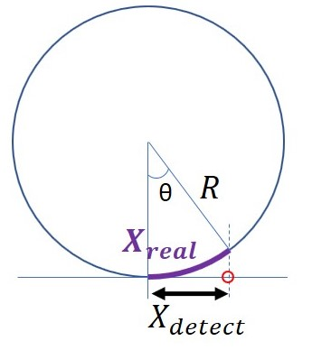

## A step-by-step tutorial for 2d single tracking, unwarpping, segmentation, and post data-processing
The purpose of the process is to flatten (unwrap) the rod-shape (cylinder part) cell envelope and register the coordinates from 2d-projection to the real position. Or covert the Xdetect to Xreal :

.
    
