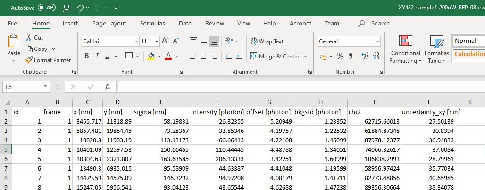
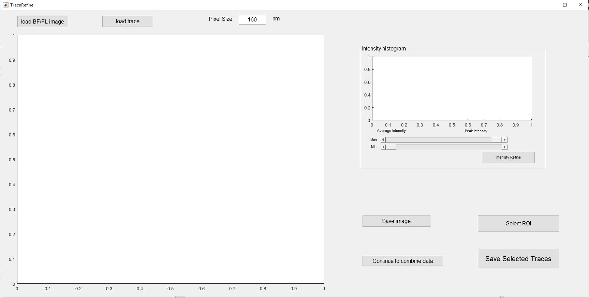
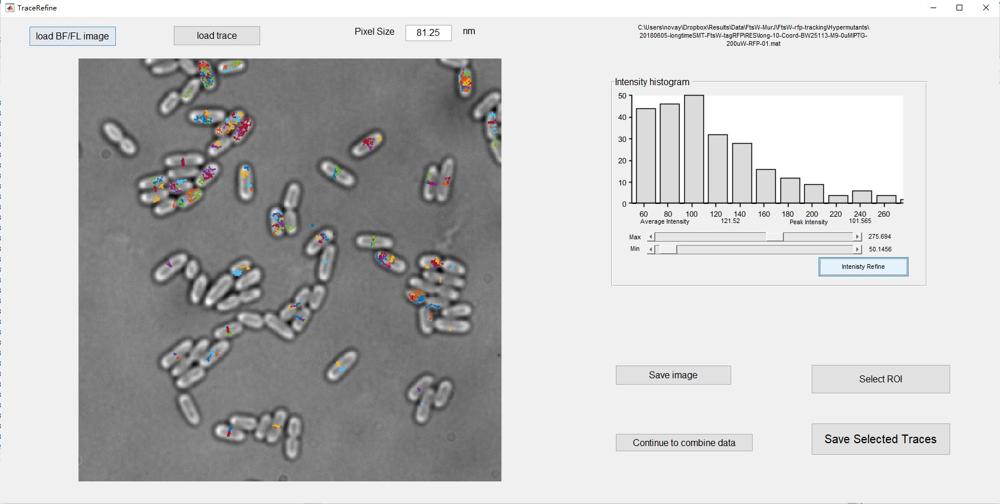
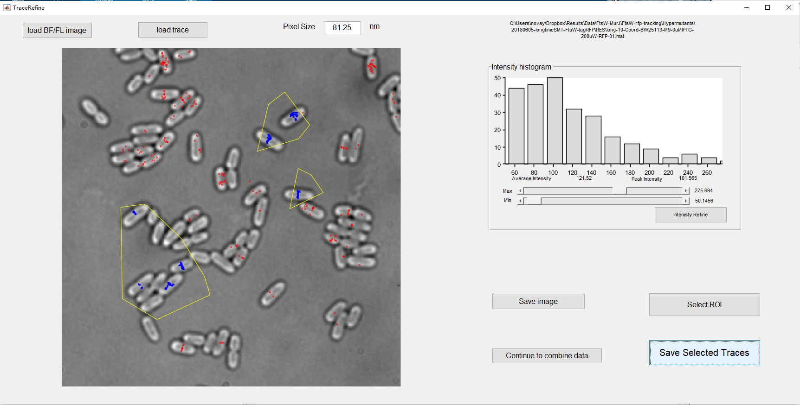
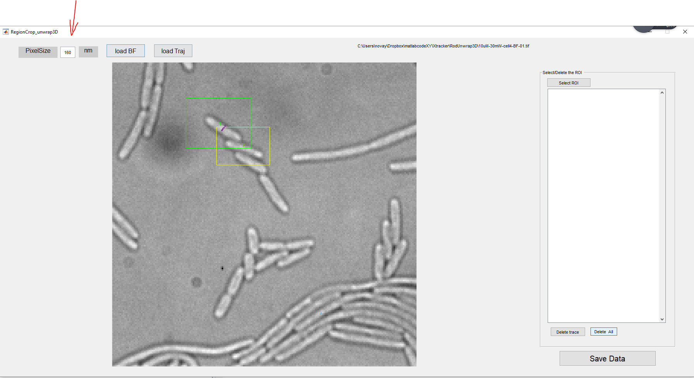
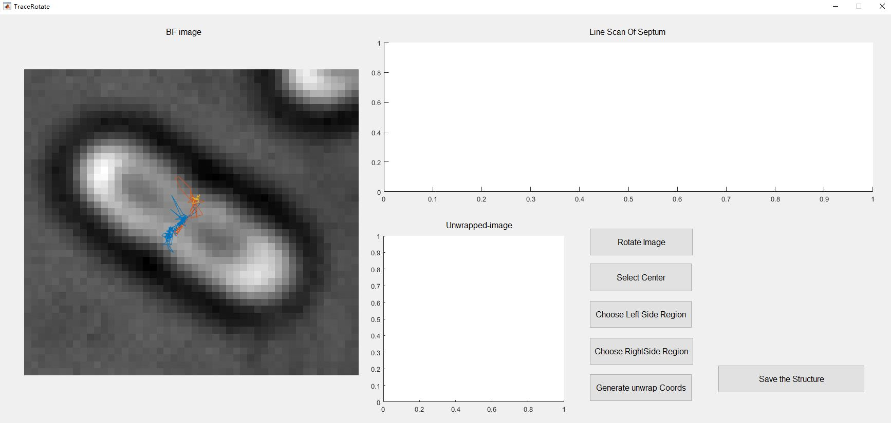
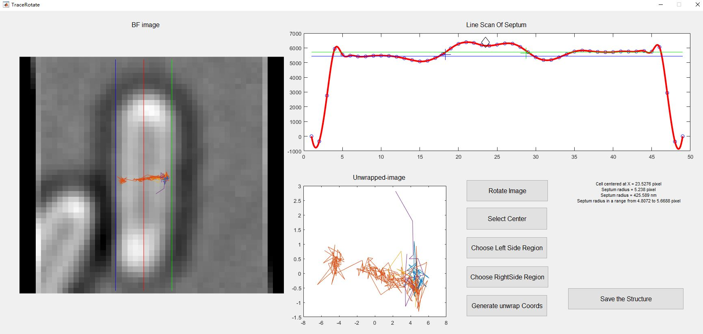

## A step-by-step tutorial for 2d single tracking, unwarpping, segmentation, and post data-processing
The purpose of the process is to flatten (unwrap) the rod-shape (cylinder part) cell envelope and register the coordinates from 2d-projection to the real position. Or covert the Xdetect to Xreal :

### Step 0: Prepare MATLAB for all the scripts
Download all the scripts and add the directory to your MATLAB path.

### Step 1: Localize single molecule spots and prepare coordiantes in right format.
We recommend using [ThunderSTORM](https://github.com/zitmen/thunderstorm) that saves the results in the '.csv' format.
An exmple of ThunderSTORM batch processing ImageJ macro script is included [here](/TrackingMainscript/FtsW-RFP-singleMoleculeLoc-Macro.txt).  Parameters for single molecule detection and localization in our paper are included in the same file. Users can use their own app or parameters to localize the spots as long as with the format as comma separeted CSV files:

Multiple result files can be saved in the same folder for the next step.

### Step 2: Link localizations to produce single molecule trajectories.
1. Run ***spotsLinking*** in MATLAB where a GUI will pop up:

   
2. Set the **Spatial Threshold** to a reasonable number like 200-400 nm (one - two pixels). This number is the distance a spot could move between two frames (if your molecule is immobile, you can use smaller number). You can also choose this paramter iteratively by the diffusion coefficient calculated from the first round of data processing.

3. Set the **Time Threshold** to a bigger number (usually 20 to 30). This is the threshold for dark interval (frame number) allowed to link two spots within the Spatial Threshsold. The big input number is for checking the off-time distribution. You will change this number in later steps.

4.	Set the **Weight of Z** to 0 in 2d tracking module.
*Note: there is a **Weight of Intensity** button not in use by now. You could also modify this in the linking code yourself.*

5.	Click the **Load Coordinate files** and select all the thunderstorm result files. This step might take a while and generate the histogram of the off-time or dark frame number between two localizations.

6. Change the **Time Threshold** to a number as 2-3 times of the ***Mean LifeTime***. You can also use other reasonable threshold as long as you keep it the same across all files from the same experiment.

7.	Set the **Minimal Trace length** to a proper number which determines the shortest trajectory length (10 frames were used in our paper). *Note: The code will save all the trajectories and the trajectories longer than this number in two set of files. You can use either one or do further processing.*

8.	Click **Link the spots and Save file**, the GUI will use the parameters on the panel to link all the files loaded and save trajectories from each file in a new file. The localizations will be saved in a .mat format named as 'Coord-XXX.mat'. The linked trajecoties will be saved in .mat files named as 'Long-XXX.mat'.

9.	If you have data in multiple folders, you can process each folder first, and click ‘Combine files’ to combine those data structures to one. *Note: you could also combine the data by the end while post-processing).*

### Step 3: Filter out bad trajectories.
*There are trajetories unwanted such as backgournd noise (not in cells), molecules in other part of the cells (not interested), or multi-molecule aggregations (high intenisty) which we should remove from the final speed/diffusion calculation.*

1. Run the ***TraceRefine*** in MATLAB. The GUI will pop up:

**Change the Pixel size according to the optical setting before doing any following steps.**

2. Click **Load BF/FL image** and **load trace** subsequentially to load the brightfield image and trajectory file from **Step 2**. The path of the file will be shown on the top-right region. The single molecule traces will be color-coded and overlaid on the left region of the GUI interface. The histogram will be displayed on the upper-right region.

3. Drag the **Max** and **Min** bar to adjust the intensity thresholds and filter out trajectories with too high or too low fluorescence (unlikely to be single molecule signal). The mean and mode of the histogram are also displayed for the consideration of your threshold. ***Note: in our lab, we usually use (mode/2 <= intensity <= mode*3) as our thesholds***. Then click **Intensity Refine** to remove all the trajectories too bright or too dim. Click **Select ROI** and the GUI will ask you to draw polygons which enclose trajectories intersted. You will have chance to reselet in the middle of the process. *Note: If you clicked **Finish** by accidenct, you will have to Press **Select ROI** again to reselect all the trajectories*.
The GUI will look like this with all selected traces marked in blue.

4. Click **Save Selected Traces** to save the chosen trajectories. Click **Save image** to save the current GUI interface.

### Step 4: Rotated individual cell and unwrap the trajectoies.

1. Run **RegionCrop_unwrap** and the GUI should pop up. Adjust the pixel size if needed. Then click **Load BF** and **Load Traj**. Change the **Date** and it will be affiliated with the Data structure.

2. Crop a region containing the  interesed single cell with empty space surrounded by clicking on the lefttop and rightbottom points. The code will pop up a new GUI: 

3. Click **Rotate Image** and type in an angle in degree (positive number is counter-clockwise while negative is clockwise rotation) to rotae the rod to the verticla direction. The Z-ring/Axis is on the horizontal direction.

4. Click the **Select Center** and click the center of the septum as accurate as possible. The line scan of the bright field image will show up at the topright:

5. The red line is the smoothed curve of the scanline. *Optional: **Choose Left Side Region** and **Choose RightSide Region** are tools for calculating the left and right side plateau of the bright field image. They are just for visulazition of the next step.*

6. Click **Generate Unwrap Coords**. Click on the cross points of the red scanline and the left plateau first, then click the cross point on the right side. The GUI will plot the selected points on the line and also display them on the bright field image. Redo this if the selection looks not perfect.

7. Click **Save the Structure**, the data will be saved and return to the main GUI.

8. Reselect another cell to process and repeat 3-7 steps until all the trajectories are rotated. *Note: if one or more trajectories are not done well, left click the item in the region list and click **Delete trace** to remove it.

9. Click **Save Data** to auto-save all the rotated trajectories companing with the cropped bright field images in the data structure. Click **Delete all** to clear the workspace before processing the next file.

