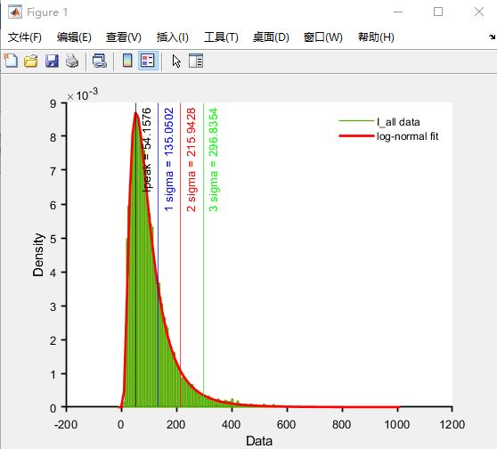
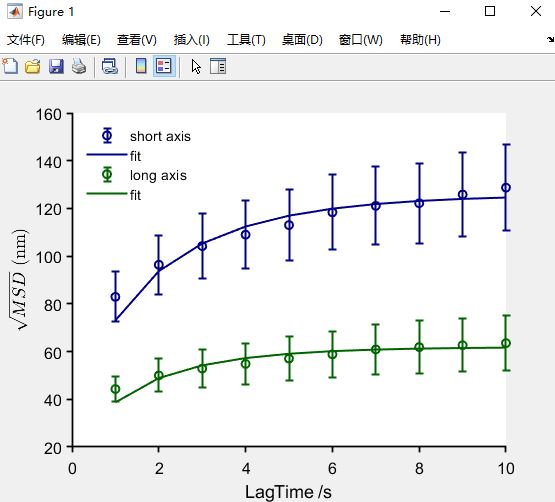
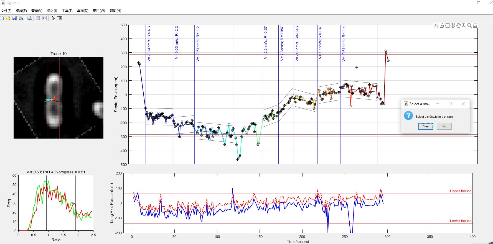
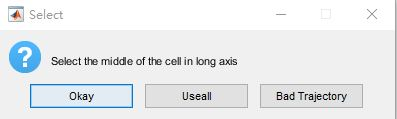
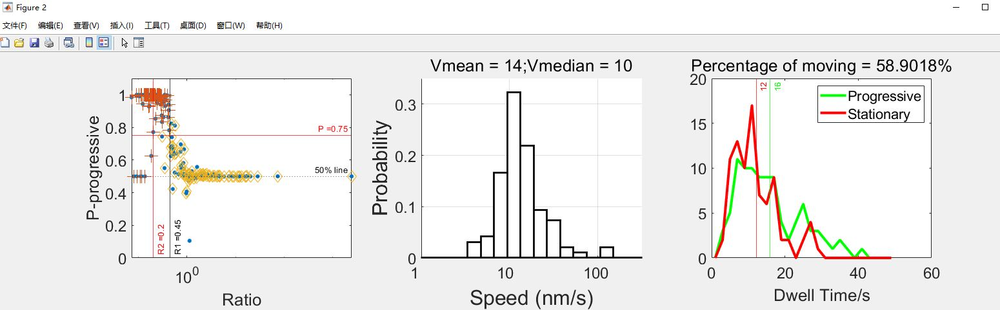

## A step-by-step tutorial for 2d single tracking, unwarpping, segmentation, and post data-processing
The purpose of the process is to flatten (unwrap) the rod-shape (cylinder part) cell envelope and register the coordinates from 2d-projection to the real position. Or covert the Xdetect to Xreal :

### Step 0: Prepare MATLAB for all the scripts
Download all the scripts and add the directory to your MATLAB path.

### Step 1: Localize single molecule spots and prepare coordiantes in right format.
We recommend using [ThunderSTORM](https://github.com/zitmen/thunderstorm) that saves the results in the '.csv' format.
An exmple of ThunderSTORM batch processing ImageJ macro script is included [here](/TrackingMainscript/FtsW-RFP-singleMoleculeLoc-Macro.txt).  Parameters for single molecule detection and localization in our paper are included in the same file. Users can use their own app or parameters to localize the spots as long as with the format as comma separeted CSV files:

Multiple result files can be saved in the same folder for the next step.

### Step 2: Link localizations to produce single molecule trajectories.
1. Run ***spotsLinking*** in MATLAB where a GUI will pop up:

   
2. Set the **Spatial Threshold** to a reasonable number like 200-400 nm (one - two pixels). This number is the distance a spot could move between two frames (if your molecule is immobile, you can use smaller number). You can also choose this paramter iteratively by the diffusion coefficient calculated from the first round of data processing.

3. Set the **Time Threshold** to a bigger number (usually 20 to 30). This is the threshold for dark interval (frame number) allowed to link two spots within the Spatial Threshsold. The big input number is for checking the off-time distribution. You will change this number in later steps.

4.	Set the **Weight of Z** to 0 in 2d tracking module.
*Note: there is a **Weight of Intensity** button not in use by now. You could also modify this in the linking code yourself.*

5.	Click the **Load Coordinate files** and select all the thunderstorm result files. This step might take a while and generate the histogram of the off-time or dark frame number between two localizations.

6. Change the **Time Threshold** to a number as 2-3 times of the ***Mean LifeTime***. You can also use other reasonable threshold as long as you keep it the same across all files from the same experiment.

7.	Set the **Minimal Trace length** to a proper number which determines the shortest trajectory length (10 frames were used in our paper). *Note: The code will save all the trajectories and the trajectories longer than this number in two set of files. You can use either one or do further processing.*

8.	Click **Link the spots and Save file**, the GUI will use the parameters on the panel to link all the files loaded and save trajectories from each file in a new file. The localizations will be saved in a .mat format named as 'Coord-XXX.mat'. The linked trajecoties will be saved in .mat files named as 'Long-XXX.mat'.

9.	If you have data in multiple folders, you can process each folder first, and click ‘Combine files’ to combine those data structures to one. *Note: you could also combine the data by the end while post-processing).*

### Step 3: Filter out bad trajectories.
*There are trajetories unwanted such as backgournd noise (not in cells), molecules in other part of the cells (not interested), or multi-molecule aggregations (high intenisty) which we should remove from the final speed/diffusion calculation.*

1. Run the ***TraceRefine*** in MATLAB. The GUI will pop up:

**Change the Pixel size according to the optical setting before doing any following steps.**

2. Click **Load BF/FL image** and **load trace** subsequentially to load the brightfield image and trajectory file from **Step 2**. The path of the file will be shown on the top-right region. The single molecule traces will be color-coded and overlaid on the left region of the GUI interface. The histogram will be displayed on the upper-right region.

3. Drag the **Max** and **Min** bar to adjust the intensity thresholds and filter out trajectories with too high or too low fluorescence (unlikely to be single molecule signal). The mean and peak of the histogram are also displayed for the consideration of your threshold. ***Note: in our lab, we usually use (peak/2 <= intensity <= peak*3) as our thesholds***. Then click **Intensity Refine** to remove all the trajectories too bright or too dim. Click **Select ROI** and the GUI will ask you to draw polygons which enclose trajectories intersted. You will have chance to reselet in the middle of the process. *Note: If you clicked **Finish** by accidenct, you will have to Press **Select ROI** again to reselect all the trajectories*.
The GUI will look like this with all selected traces marked in blue.

4. Click **Save Selected Traces** to save the chosen trajectories. Click **Save image** to save the current GUI interface.

### Step 4: Rotated individual cell and unwrap the trajectoies.

1. Run **RegionCrop_unwrap** and the GUI should pop up. Adjust the pixel size if needed. Then click **Load BF** and **Load Traj**. Change the **Date** and it will be affiliated with the Data structure.

2. Crop a region containing the  interesed single cell with empty space surrounded by clicking on the lefttop and rightbottom points. The code will pop up a new GUI: 

3. Click **Rotate Image** and type in an angle in degree (positive number is counter-clockwise while negative is clockwise rotation) to rotae the rod to the verticla direction. The Z-ring/Axis is on the horizontal direction.

4. Click the **Select Center** and click the center of the septum as accurate as possible. The line scan of the bright field image will show up at the topright:

5. The red line is the smoothed curve of the scanline. *Optional: **Choose Left Side Region** and **Choose RightSide Region** are tools for calculating the left and right side plateau of the bright field image. They are just for visulazition of the next step.*

6. Click **Generate Unwrap Coords**. Click on the cross points of the red scanline and the left plateau first, then click the cross point on the right side. The GUI will plot the selected points on the line and also display them on the bright field image. Redo this if the selection looks not perfect.

7. Click **Save the Structure**, the data will be saved and return to the main GUI.

8. Reselect another cell to process and repeat 3-7 steps until all the trajectories are rotated. *Note: if one or more trajectories are not done well, left click the item in the region list and click **Delete trace** to remove it.

9. Click **Save Data** to auto-save all the rotated trajectories companing with the cropped bright field images in the data structure. Click **Delete all** to clear the workspace before processing the next file. The data structure should be named as 'XXX-TraceInfo-XXX.mat'.

### Step 5: Simulate a set of trjactories with confined diffusion (stationary) behavior.

*Note: This simulation is for segmentation in the next step. The stationary molecules are supposed to the only other type of movement from directional movement.*

1. Run section0 of ***statesSegP.m***:
~~~
clear; clc;
Frame_L = [5:400]; % the range of the possible trajectory length
ExpT = 1; % the exposure time (if there is dark interval, this should be total time interval)
D = 0.0005; % diffusion coefficient: in um^2/s
B = 100; % boundary size  in nm
L_err = 30; % localization error in nm
N_traj = 2000; % number of trajectories for simulation in one condition
filenameSimu = 'FileName.mat'; % filename to save the simulation result
% simulation
[R_struc,Traj_struc,TimeMatrix,frameMatrix,SpeedMatrix] = rcdfCal(Frame_L,0,ExpT,D,B,L_err,N_traj);
save(filenameSimu,'R_struc','Traj_struc','TimeMatrix','frameMatrix','SpeedMatrix','Frame_L');
~~~
The parameters above are used in our study. User should change it according the experimental conditions.
The data will be saved in ***filenameSimu*** used defined.

***Note: the simulation can be time consuming, you might need to prepare for an overnight (or even longer) computation. If you really need it to be fast, use a smaller sample size (N_traj = 100 or 200).***

2. We recommend that use a strigent (small diffusion coefficient and small confined length) condition to do a first round simulation. Using these simulated trajectories to do the segmentation in Step 6 on a typical sample set and find all the 'stationary' segments. Then calculate the D, B. and L_err from the real data as in Step 7. If they show a big difference from the initial guess, use the experimental D, B, and L_err to re-simulate a set of trajctories for Step 6.

### Step 6: Simulate a set of trjactories with confined diffusion (stationary) behavior.

1. Run section1 of ***statesSegP.m***. Select all the trajectories files from Step 4 of the same condition and the script will calculate the intensity histograme of individual points of all trajectories. Click on any place in the figure to continue.

Make sure to set ~Experiment = '2D_Tracking'; ~

You need to input the intenisty threshold to filter out single points with intensity greater than the threshold.

2. The script will continue to calculate the MSD curves in X-(short axis of the cell) and Y-(long axis of the cell). This step might take some time when the number of files is big. Click on any place in the figure to continue.

Type in the range of X- and Y- axis of the confinment. Use half of the plateau of X-MSD and the Y-MSD. *Note: This step is just to generate a visible indicator for the Step 7. The number is not very critical.*

3. Save the refined and combined data structure to a user defined name. *Note: the code will also save the trajectories plotted with intensity and which data points are removed. This section take a while for writing the images.*

### Step 7: Segment every trajectories.

1. Run Section2 of ***statesSegP.m***. Make sure to set the parameters below according to the experimental conditions.

~~~
Input_Params.Experiment = '2D_Tracking'; 
Input_Params.PixelS = 100; % pixel size in nm
Input_Params.ExpT = 1; % time interval in second
Input_Params.TimeRange = [-10,400]; % the time range for trajectory ploting in sec ,better to have some space on both side
Input_Params.PosiXRang = [-500,500]; % the position range of short axis for plotting in nm
Input_Params.PosiYRang = [-200,200]; % the position range of short axis for plotting in nm
Input_Params.Nboot = 100; % number of the bootstrapping to get linear fitting
Input_Params.Pdrop = 0.1; %dropout probability in bootstrapping e.g.0.1 means remove 10% of the points in each segment for Bootstrapping
~~~

The code will ask you to select the simulation dataset from Step 5 and the experimental dataset from Step 6. After this step, you should find a variable in work space named as ***IndTrack*** which contains all the information of each trajctory. The length of ***IndTrack*** is the number of trajectories. 

2. Change the ***Index*** from 1 to the length of ***IndTrack***. Everytime, run section3 of ***statesSegP.m***. The GUI will pop up, and you can segment the trajectory one state by one state:

   * The cell and trajectory is plot on the up-left side for visualization.
   * The position of the molecule on the long axis against time is plot on the bottom right. First select the part of the trajectory located to the septum (or a position of interest) by click **Okay** in the popped-up box and click two end of the region you want to choose. If the whole trajectory is somewhat localized in the region, clcik ** Useall**, the code will use all the positions to calculate. If the trajectory is completely off center, you can use **Bad Trajectory** to quit and do the next one.
   
   
   
   * Then the trajectory along the short axis will displays on the upper right region. Click on the possible start and end position of a segment with distinctive movement mode. The linear fit will display on top of the trajectory, the probability distribution from bootstrapping is shown on the bottom left region. You can check the probability of the segment to be directional or not. (The smaller R is, and greater P-progress is, it is more likely to be directional movement.). It is good to iteratively re-segment the same trajctory (Training you own neuron net:).
   
   
### Step 8: Post-processing: classify the directional and stationary population, calculate the speed, diffusion property, and dwell time.

1. Classify the segments and get the speed and dwell time for directional and stationary segments: Open ***DwellSpeedCalc.m*** and adjust the parameters for segmentation and plotting:
~~~
Nbin = 31;   % The number of bins to plot speed distribution in log-scale
LowB = -1.5; % The Lower bound of plotting speed distribution in log-scale 10LowB
HighB = 3;   % The upper bound of plotting speed distribution in log-scale 10HighB
Rmax1 = 0.45; % maximum R value for directional movement
Rmax2 = 0.2; % R for long directional segments which might have samller P
StDmax = 80; % The boundary of standard deviation to justify stationary phase.
Pmin = 0.75; % minimum probability for directional movement.
Nb = 1000; % bootstrapping number to get statistic of the population fraction
~~~

Run the script and select the segemented results from Step 7. The classification result, speed distribution, and dwell time distribution will be plot in a new figure:

Save the data structure to user defined name.

2. Fit speed distribution in ***cdfBootFitting.m*** or customized code.

